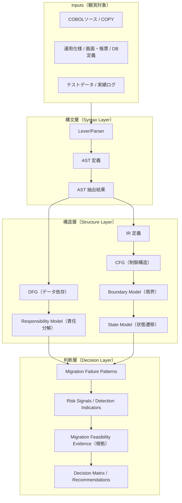
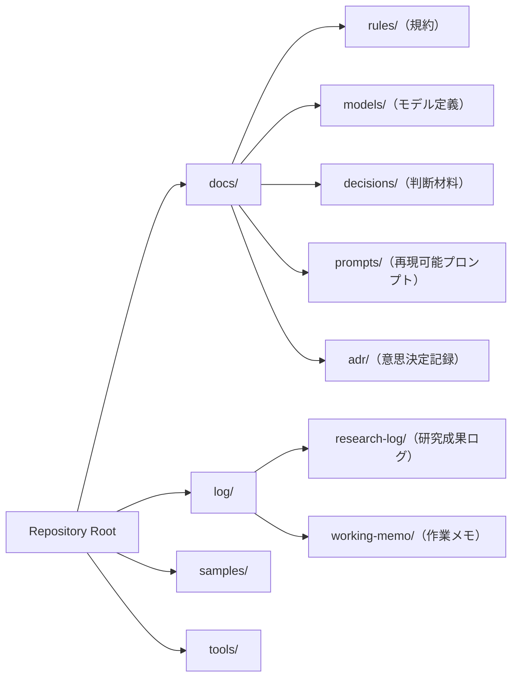

# 01_Project-Overview.md（正式版 / Mermaid強化）

> リポジトリ：**cobol-structure-analysis-lab**  
> 研究空間：**COBOL構造解析研究室**  
> 目的：COBOL資産の構造解析により、移行判断の根拠（構造的証拠）を生成する。

---

## 1. この研究室が扱う問い

移行は「技術課題」ではなく、しばしば **構造課題**として破綻する。

- **境界が定義されない**（何をどこまで移すのかが曖昧）
- **責任が分解されない**（誰が何を決めるのかが曖昧）
- **状態が抽象化されない**（状態遷移が属人化し、仕様が崩れる）
- **SoR（System of Record）が固定されない**（真実が複数化し二重更新が起きる）

本研究室はこれらを「失敗談」ではなく、**構造パターン**としてモデル化する。

---

## 2. 抽象度レベル（必ず分離する）

本研究は成果物を **3層**で管理する（層混在は原則禁止）。

### 2.1 構文層（Syntax Layer）
- COBOL構文仕様の解釈、ASTノード設計、文法境界

### 2.2 構造層（Structure Layer）
- AST/IR/CFG/DFG、境界モデル、責任分解、状態遷移抽象

### 2.3 判断層（Decision Layer）
- 移行可否判断材料（リスク、影響、制約、移行戦略の前提）

---

## 3. 研究アウトカム（成果物の型）

この研究室が生成する成果物は **「判断材料」**に収束させる。

- **モデル定義**：AST/IR/CFG/DFG、境界・責任・状態の抽象モデル
- **分類体系**：Migration Failure Patterns / アンチパターン
- **診断可能性**：破綻予兆（構造シグナル）と検出指標
- **運用可能性**：ログ体系、再現可能な研究手順、ADRでの意思決定履歴

---

## 4. リポジトリ構造（正式）

> 研究室のファイルは「いつ・何を・どの抽象度で」作ったかが追跡できること。

### 4.1 推奨ディレクトリ

- `docs/`：公開可能な設計文書（モデル定義・ルール・ガイド）
- `docs/rules/`：抽象化・命名・粒度などの規約
- `docs/models/`：AST/IR/CFG/DFG・境界/責任/状態モデル
- `docs/decisions/`：判断材料（移行可否・リスク定義・根拠）
- `docs/prompts/`：Cursor/Codex等に投げるプロンプト（再現性のため）
- `docs/adr/`：意思決定記録（Architecture Decision Records）
- `log/research-log/`：研究ログ（テンプレ＋日付別成果）
- `log/working-memo/`：作業メモ（実務的メモ、後から研究成果へ昇格）
- `samples/`：最小サンプル（解析対象の小片、テスト入力）
- `tools/`：検証・抽出・比較ツール（将来的な自動化の入口）

---

## 5. Mermaid：構造全体像（成果物フロー）

---

## 6. Mermaid：リポジトリ構造（運用モデル）

---

## 7. 命名規約（最低限）

### 7.1 日付プレフィックス（成果の時系列を固定）
- `YYYY-MM-DD_<Topic>.md` を基本とする  
  例：`2026-03-01_Migration-Failure-Patterns.md`

### 7.2 抽象度が分かる見出し
- 見出しに層を明示（例：`構文層 / 構造層 / 判断層`）

### 7.3 プロンプトは再現性を優先
- `docs/prompts/` 配下に保存
- 目的・入力・出力条件・禁止事項を必ず含める

---

## 8. 運用ルール（研究→成果への昇格）

1. `log/working-memo/` に作業メモを残す（荒くて良い）
2. 研究として成立したら `log/research-log/` に昇格（テンプレ準拠）
3. モデル定義は `docs/models/` に抽出・整理
4. 判断材料は `docs/decisions/` に確定
5. 方針変更・判断は `docs/adr/` に記録（後から説明可能に）

---

## 9. 最終ゴール（この研究室の勝ち筋）

- 変換の可否を「経験」ではなく **構造根拠**で説明できる
- 破綻を「運が悪い」ではなく **パターン**として予防できる
- 移行設計責任者が判断を下すための **共通言語（モデル）**が揃う

---

## 付録：このドキュメントの位置づけ

- 本ファイルは **研究室の憲法（Project Overview）**
- 詳細は `docs/models/` と `docs/decisions/` に分割して育てる
