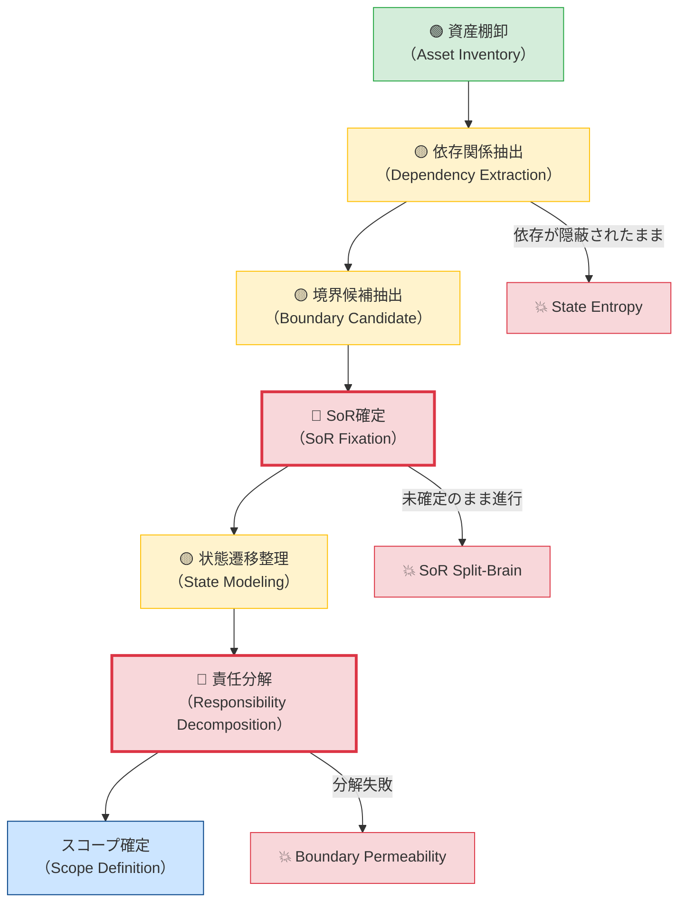

# 02_Scope-Definition-Framework.md

> COBOL構造解析研究室  
> テーマ：移行スコープ定義の構造フレームワーク

---

## 1. 問題設定

移行プロジェクトにおける最初の破綻要因は
**「何を移行対象とするかが構造的に定義されないこと」**である。

スコープは作業範囲ではなく、
**境界の確定行為**である。

---

## 2. スコープ定義の三層モデル

### 2.1 資産層（Asset Layer）
- COBOLプログラム群
- COPY句
- JCL
- バッチ制御
- DB定義
- 外部IF仕様

### 2.2 構造層（Structure Layer）
- 制御フロー（CALL関係 / PERFORM構造）
- データ依存（共有WORKING-STORAGE / ファイル依存）
- 状態遷移
- トランザクション境界
- SoR（System of Record）

### 2.3 判断層（Decision Layer）
- 分離可能性
- 独立展開可能性
- 並行稼働可否
- 二重更新リスク
- フェーズ分割可能性

---

## 3. スコープ定義の基本原則

### 原則1：境界は「機能」ではなく「責任」で切る

✕ 画面単位  
✕ 帳票単位  

◯ データ責任単位  
◯ SoR単位  
◯ 状態遷移単位  

---

### 原則2：SoRは必ず固定する

- 真実の所在が複数存在する状態は禁止
- 並行稼働中の暫定SoRも明示する
- 二重更新を許容するなら明文化する

---

### 原則3：依存方向を可視化する

依存は必ず一方向であるべき。

逆流がある場合、スコープは不安定となる。

---

## 4. スコープ定義プロセス（構造版）

### 4.1 プロセスフロー（失敗リスク重み付き）

リスクレベルの凡例：
- 🔴 **HIGH**：このステップで止まると下流が全て崩壊する
- 🟡 **MEDIUM**：不完全でも先へ進めるが、後工程で必ず回収コストが発生する
- 🟢 **LOW**：機械的に実施可能、最も失敗しにくい

---

### 4.2 ステップ別 失敗リスク詳細

#### 🟢 STEP 1：資産棚卸（LOW）

**なぜ失敗しにくいか**：  
COBOLプログラム本数・画面数・外部IF数は物理的に存在するため、数え間違いはあっても「見えない」ことはほぼない。

**注意点**：  
棚卸の「漏れ」よりも「COPY句の共有依存」が後工程で爆発する。

---

#### 🟡 STEP 2：依存関係抽出（MEDIUM）

**なぜ中リスクか**：  
CALL関係・ファイル共有・WORKING-STORAGE共有は、静的解析で相当程度抽出できる。しかし**暗黙的なデータ依存**（同一ファイルを複数プログラムが独立更新）は検出が難しい。

**未完了のまま進んだ場合の結果**：  
→ `State Entropy`（状態遷移エントロピー）の種が埋め込まれる。

---

#### 🟡 STEP 3：境界候補抽出（MEDIUM）

**なぜ中リスクか**：  
「ここで切れそうだ」という候補は出しやすいが、**粒度の選択ミス**（`03_Scope-Granularity-Levels`参照）が後工程で顕在化する。

**未完了のまま進んだ場合の結果**：  
→ スコープが粗すぎて「全面移行か否か」の二択しか残らなくなる。

---

#### 🔴 STEP 4：SoR確定（HIGH）

**なぜ最高リスクか**：  
これは技術問題ではなく**意思決定問題**である。「どちらのシステムがデータの正本か」を確定することは、組織間の権限調整・業務ルールの再定義を伴うため、先送りされやすい。

**未確定のまま進んだ場合の結果**：  
→ `SoR Split-Brain`（二重更新・データ崩壊）が必ず発生する。  
→ **このステップが未完了であれば、下流のすべてのステップは砂上の楼閣である。**

**判断基準**：  
SoRが「議論中」「暫定」のままでPhase実装に入ることは、設計上の禁止事項とする。

---

#### 🟡 STEP 5：状態遷移整理（MEDIUM）

**なぜ中リスクか**：  
状態遷移は業務仕様書に明示されていないことが多く、COBOLコードのPERFORM構造から逆算することになる。定義は可能だが**漏れやすい**。

**未完了のまま進んだ場合の結果**：  
→ 並行稼働期間中に「どちらが正しい状態か」が判定不能になる。

---

#### 🔴 STEP 6：責任分解（HIGH）

**なぜ最高リスクか**：  
「誰がどのデータを更新してよいか」は、技術的な制約に加えて**組織的・業務的な合意**を必要とする。合意なき責任分解は形式上存在しても実効性がない。

**未完了のまま進んだ場合の結果**：  
→ 境界が設計上存在しても現場で遵守されず、`Boundary Permeability`（境界透過性）が実運用で発生する。

**判断基準**：  
「誰が決めるか」ではなく「どの構造が責任を持つか」で定義すること。人ではなくシステムに責任を帰属させる。

---

## 5. スコープ評価指標

### 5.1 境界明確度
- データ所有が単一か
- 更新責任が一意か

### 5.2 依存純度
- 循環依存がないか
- フェーズ逆流がないか

### 5.3 状態完結性
- 状態遷移が閉じているか
- 外部暗黙依存がないか

---

## 6. 破綻シグナル

以下が観測された場合、スコープは未成熟。

- SoRが議論中のまま実装開始
- フェーズ間でデータ逆流
- 「とりあえず全部移す」という判断
- 依存関係図が存在しない

---

## 7. 最終目的

スコープを「作業範囲」ではなく、

> 境界構造として定義する。

これにより、移行可否は
作業量ではなく構造安定性で評価可能となる。
