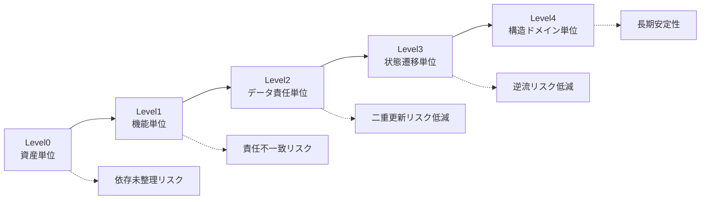
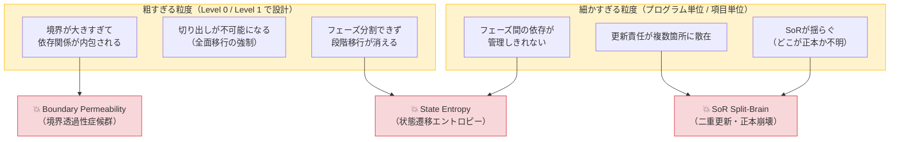

# 03_Scope-Granularity-Levels.md

> COBOL構造解析研究室  
> テーマ：スコープ粒度レベル（Scope Granularity Levels）

---

## 1. 問題設定

移行スコープは「含める／含めない」の二値では定義できない。

真の問題は：

> どの粒度（Granularity）で境界を切るか

である。

粒度が粗すぎれば分離不能となり、
細かすぎれば責任が分散し破綻する。

本ドキュメントは、スコープ粒度を階層モデルとして定義する。

---

## 2. スコープ粒度の5段階モデル

### Level 0：資産単位（Asset Level）
- プログラム単体
- COPY句単体
- JCL単体

❗ 特徴：構造を無視した最小単位  
❗ 問題：依存関係が未整理

---

### Level 1：機能単位（Functional Level）
- 画面単位
- 帳票単位
- バッチ単位

❗ 特徴：業務視点  
❗ 問題：データ責任と一致しないことが多い

---

### Level 2：データ責任単位（Data Responsibility Level）
- テーブル群単位
- SoR単位
- 更新責任単位

✅ 推奨最小安定単位  
✅ 二重更新検出が可能

---

### Level 3：状態遷移単位（State Transition Level）
- 業務状態集合単位
- トランザクション境界単位
- フェーズ単位

✅ 並行稼働設計の前提  
✅ フェーズ逆流検出が可能

---

### Level 4：構造ドメイン単位（Structural Domain Level）
- 業務ドメイン境界
- サブシステム境界
- アーキテクチャ責任境界

✅ 長期安定構造  
✅ 将来拡張性を含む

---

## 3. 粒度とリスクの関係

---

## 4. 粒度選定原則

### 原則1：最低でもLevel2以上で定義する

Level0 / Level1 は
移行設計単位としては不十分。

---

### 原則2：並行稼働がある場合はLevel3必須

状態遷移が閉じていないスコープは
並行期間中に破綻する。

---

### 原則3：最終アーキテクチャを見据える場合はLevel4で固定

単発移行ではなく、
再構築を伴う場合はLevel4で設計する。

---

## 5. 粒度誤りパターン

粒度の誤りは「選択ミス」ではなく、**構造破綻の誘因**である。
誤った粒度は `06_Structural-Failure-Analysis` で定義した3つの構造破綻パターンに直結する。

### 5.1 粒度と破綻パターンの対応マップ

---

### 5.2 粗すぎる場合（Level 0 / Level 1 での設計）

**何が起きるか：**

境界が業務機能単位（画面・帳票・バッチ）で定義されると、内部のデータ依存・状態依存が境界内に封じ込められたまま移行対象に含まれる。これは「切り出し」ではなく「塊の移動」である。

**発生する構造破綻：**

| 破綻パターン | 発生メカニズム |
|:---|:---|
| **Boundary Permeability** | 業務機能境界の内側にデータ共有・CALL依存が存在し、新旧システム間の境界が実装詳細で接続されたままになる |
| **State Entropy** | 状態遷移が機能単位に分散したまま移行されるため、状態の一貫性を新旧どちらが保証するか定義できない |

**典型的な誤判断：**

> 「この機能は小さいので丸ごと移せばいい」

→ 内部の共有WORKING-STORAGEやVSAMファイル依存が見落とされ、境界が実際には閉じていない。

---

### 5.3 細かすぎる場合（プログラム単位・項目単位での設計）

**何が起きるか：**

COBOLプログラム1本単位・DB項目単位でスコープを切ると、「どの単位が更新責任を持つか」が定義できなくなる。更新責任が複数の小スコープに分散し、誰も全体の整合性を保証できない状態になる。

**発生する構造破綻：**

| 破綻パターン | 発生メカニズム |
|:---|:---|
| **SoR Split-Brain** | 粒度が小さすぎるため「在庫数量」のような単一項目を複数のスコープが個別に更新するようになり、正本が多重化する |
| **State Entropy** | 状態遷移が複数の小スコープに分断されて実装され、遷移ガード条件を共有できなくなる |

**典型的な誤判断：**

> 「依存を最小にするためにプログラム1本ずつ移す」

→ 責任の粒度がプログラム単位（Level 0）になり、データの更新責任が事実上宙に浮く。

---

### 5.4 粒度誤り診断チェック

以下の問いに一つでも「否」があれば、現在の粒度定義は誤りである。

| 診断項目 | Yes | No |
|:---|:---:|:---:|
| スコープ内のSoRが単一のシステムに固定されているか | ✅ | 🔴 粒度を上げよ |
| 状態遷移がスコープ内で完結しているか | ✅ | 🔴 粒度を上げよ |
| 境界がI/Oインターフェースとして明示できるか | ✅ | 🔴 粒度を見直せ |
| 並行稼働中に更新責任が衝突しないか | ✅ | 🔴 粒度を下げよ |
| フェーズ間の依存方向が一方向に保たれるか | ✅ | 🔴 粒度を再定義せよ |

---

## 6. 判断層への接続

スコープ粒度が確定していない場合、

- 部分移行可否
- 並行稼働設計
- リスク評価
- コスト見積根拠

は成立しない。

粒度は「作業分割」ではなく、

> 構造安定度の選択である。

---

## 7. 最終定義

スコープ粒度レベルとは：

> 境界安定性と責任一意性を保証するための階層的抽象モデル

適切な粒度選択により、
移行は破綻確率の制御対象となる。
