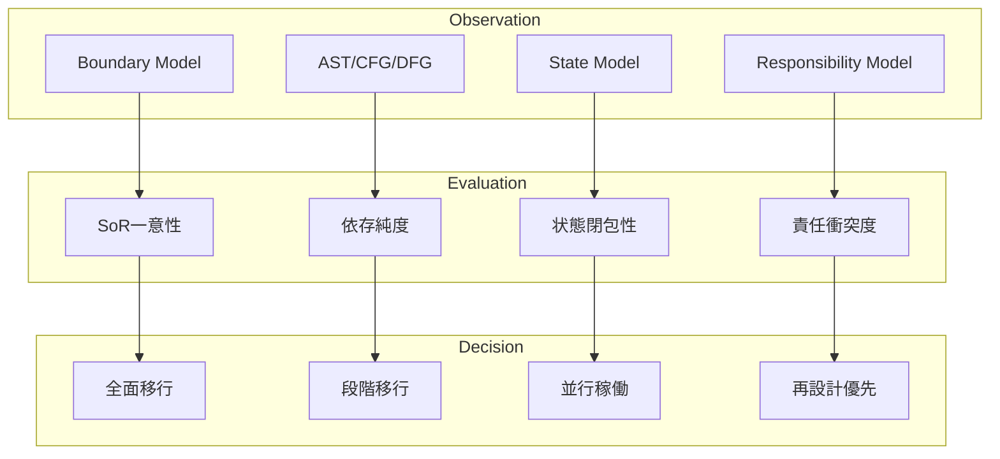

# 04_Migration-Decision-Mapping.md

> COBOL構造解析研究室  
> テーマ：移行判断マッピング（Migration Decision Mapping）

---

## 1. 問題設定

移行判断はしばしば「感覚」「経験」「空気」で行われる。

しかし本研究室では、移行判断を

> 構造要素 → リスクシグナル → 判断結論

の写像（Mapping）として定義する。

判断は結果ではなく、
**構造観測から導かれる帰結**でなければならない。

---

## 2. 判断マッピングの三層構造

### 2.1 観測層（Observation Layer）
- AST構造
- CFG（制御依存）
- DFG（データ依存）
- 境界モデル
- 責任分解モデル
- 状態遷移モデル

### 2.2 評価層（Evaluation Layer）
- SoR一意性
- 二重更新可能性
- 循環依存有無
- フェーズ逆流有無
- 状態閉包性
- 境界安定度

### 2.3 判断層（Decision Layer）
- 全面移行
- 段階移行
- 並行稼働必須
- 分離再構築
- 移行不可（再設計優先）

---

## 3. 構造 → 判断 の写像モデル

---

## 4. 代表的判断マッピング例

### ケース1：SoR未固定 + 二重更新可能

評価結果：
- SoR一意性 ×
- 責任衝突度 高

判断：
→ 並行稼働不可  
→ 先に責任再設計

---

### ケース2：循環依存あり + 状態未閉包

評価結果：
- 依存純度 ×
- 状態閉包性 ×

判断：
→ 段階移行不可  
→ 境界再定義必須

---

### ケース3：責任一意 + 状態閉包 + SoR固定

評価結果：
- 主要評価指標 安定

判断：
→ 段階移行可能  
→ 並行期間短縮可能

---

## 5. 判断マトリクス（概念モデル）

| 構造安定度 | SoR固定 | 状態閉包 | 依存純度 | 推奨判断 |
|------------|----------|-----------|-----------|-----------|
| 低         | ×        | ×         | ×         | 再設計優先 |
| 中         | △        | △         | △         | 並行稼働 |
| 高         | ○        | ○         | ○         | 段階移行 |
| 非常に高   | ○        | ○         | ○（完全） | 全面移行可 |

---

## 6. 判断誤りパターン

### 6.1 作業量基準判断
「小さいから先に移す」

→ 構造無視型破綻

---

### 6.2 組織都合判断
「この部署が担当だから分ける」

→ 責任と境界の不一致

---

### 6.3 技術難易度基準判断
「変換しやすいから先に」

→ SoR逆転リスク

---

## 7. 最終定義

Migration Decision Mapping とは：

> 構造観測結果を、論理的に移行判断へ写像するための評価体系

移行判断を「説明可能な構造帰結」に変換することが、
本研究室の目的である。
