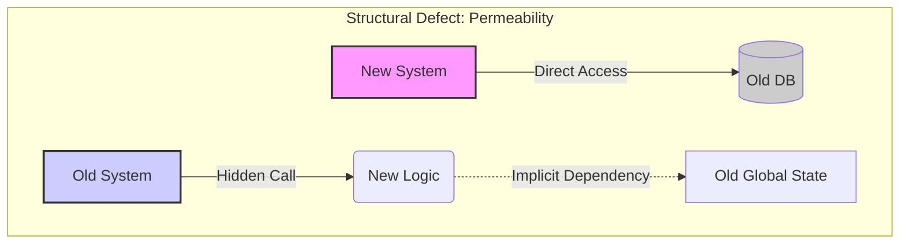
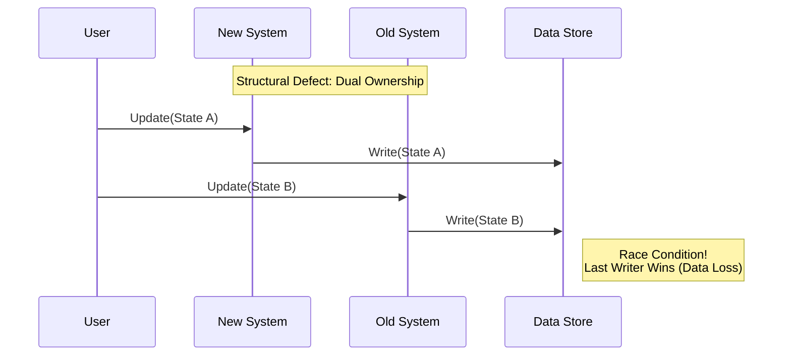
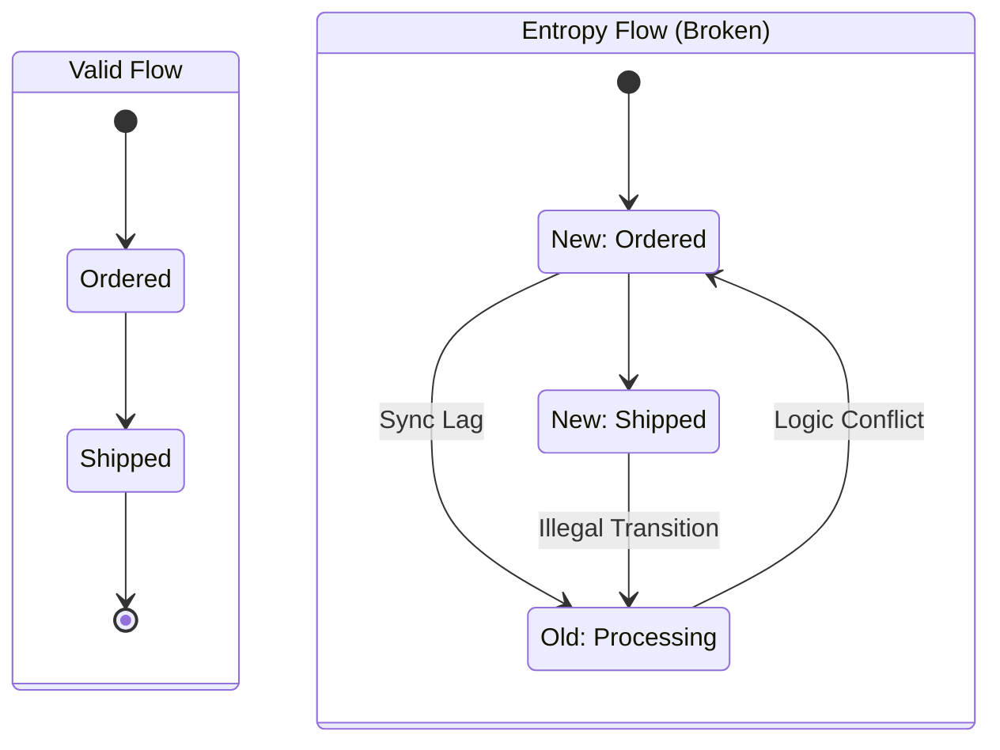

# Migration Failure Patterns: Structural Analysis
移行破綻の構造解析とモデル化

---

## 0. 本文書の位置付け
本分析は、移行プロジェクトの失敗を個別の技術要因やマネジメント不足としてではなく、システムアーキテクチャおよび設計における「構造的欠陥（Structural Defect）」として再定義する試みである。

---

## 1. 問題の再定義：構造的破綻とは

移行プロジェクトの失敗は、コードの誤り（Implementation Error）ではなく、**「系（System）」としての整合性維持能力の喪失**であると定義する。

新旧システムが共存する過渡期において、以下の2点が欠落することで「構造破綻」が発生する。

1.  **境界の保存則**：系と系の境界が物理的・論理的に閉じておらず、副作用が漏出している。
2.  **責任の排他性**：データの正本（Original）に対する変更権限が排他的に制御されていない。

---

## 2. 構造破綻パターンの再構成

従来の失敗パターンを構造的視点から再整理し、以下の3つの「構造破綻モデル」に統合する。

| 分類 | パターン名称（構造定義） | 旧分類との対応 |
| :--- | :--- | :--- |
| **境界破綻** | **Boundary Permeability (境界透過性症候群)** | 境界未確定型 フェーズ依存逆流型 |
| **責任破綻** | **SoR Split-Brain (SoRスプリットブレイン)** | SoR未固定型 二重更新型 |
| **論理破綻** | **State Entropy (状態遷移エントロピー)** | 状態遷移未整理型 |

---

## 3. 各パターンの構造解析

### ① Boundary Permeability (境界透過性症候群)

**定義**:  
新旧システムの境界が「契約（Contract）」ではなく「実装の詳細（Implementation Detail）」で結合しており、影響範囲が限定できない状態。

*   **構文層（現象）**:
    *   新システムが旧システムのDBを直接参照している（密結合）。
    *   移行フェーズが進むにつれ、スパゲッティコード化した依存関係が解決不能になる。
    *   「とりあえず動く」連携が量産され、誰も全体像を把握できない。
*   **構造層（実体）**:
    *   **カプセル化の破壊**: 内部構造への直接依存（White-box Dependency）が発生している。
    *   **循環依存**: 新→旧、旧→新の依存が混在し、有向非巡回グラフ（DAG）が成立していない。
*   **判断層（影響）**:
    *   **移行不可（Deadlock）**: 切り離しコストが指数関数的に増大し、プロジェクトが停止する。

---

### ② SoR Split-Brain (SoRスプリットブレイン)

**定義**:  
同一のデータ実体に対し、異なるコンテキスト（新旧）が同時に「正本（Master）」としての振る舞いを行い、データの整合性が崩壊する状態。

*   **構文層（現象）**:
    *   データ不整合、消失、先祖返りが発生する。
    *   「どちらのデータが正しいか」の調査に工数が忙殺される。
    *   バッチ処理による夜間同期の競合（Race Condition）。
*   **構造層（実体）**:
    *   **Write Ownerの多重化**: 単一のResourceに対し、排他制御なき複数のWriterが存在する。
    *   **時制の不一致**: System AとSystem Bで「現在」の定義が異なっている（同期ラグによる因果律の崩壊）。
*   **判断層（影響）**:
    *   **信頼性喪失（Distrust）**: データに対する信頼が失われ、新システムへの切り替えが承認されない。

---

### ③ State Entropy (状態遷移エントロピー)

**定義**:  
業務ドメインの状態遷移ルール（State Machine）が新旧システムに断片化・重複し、システム全体としてどの状態にあるかが決定不能になる状態。

*   **構文層（現象）**:
    *   新システムで「出荷済み」なのに、旧システムで「在庫引当」に戻される。
    *   想定外のステータス遷移によるエラー多発。
    *   業務フローがスタックし、手動リカバリが頻発する。
*   **構造層（実体）**:
    *   **ロジックの分散**: 同一のState Machineの一部がNew Systemに、別の一部がOld Systemに実装されている。
    *   **ガード条件の欠落**: 遷移を許可する条件（Guard）が共有されていない。
*   **判断層（影響）**:
    *   **業務破綻（Collapse）**: オペレーションが継続できず、ロールバックを余儀なくされる。

---

## 4. 設計責任者としての構造設計原則（防止策）

構造解析に基づき、移行を成功させるための「構造設計原則」を以下に定める。これらは作業手順ではなく、設計上の制約条件である。

### Principle 1: Explicit Boundary Definition (境界の明示的定義)
*   **原則**: I/O境界は、物理的インターフェース（API/File）として固定し、内部ロジックやDBへの直接参照（ショートカット）を禁止する。
*   **判定指標**: 依存関係グラフを描画した際、新旧間に循環参照が存在しないこと（DAGの維持）。

### Principle 2: Single Writer Ownership (単一書き込み権限)
*   **原則**: 任意の時点において、特定のデータセットに対する「更新権限（Write Permission）」を持つシステムは一つに限定する。
*   **判定指標**: 全てのテーブル/データ項目に対し、現在どちらのシステムがWriterであるかがマッピングされ、コードレベルで強制されていること。

### Principle 3: State Machine Monolith (状態機械の単一性)
*   **原則**: 状態遷移を制御するロジック（State Machine）は分割せず、常に片方のシステムに閉じて実装する。
*   **判定指標**: ステータス変更を伴うトランザクションが、新旧を跨いで実行されていないこと。

---

## 5. 結論：移行可否の構造的判断基準

本分析の結果、移行プロジェクトの可否（Go/No-Go）は、以下の構造的条件が満たされているかで判断すべきである。

1.  **境界が閉鎖されているか？** (Is the boundary closed?)
    *   Yes: 影響範囲を制御可能
    *   No: **Boundary Permeability** (移行不可)

2.  **更新責任が単一か？** (Is the writer singular?)
    *   Yes: データ整合性を維持可能
    *   No: **SoR Split-Brain** (データ崩壊)

3.  **状態遷移が一貫しているか？** (Is the state machine consistent?)
    *   Yes: 業務継続可能
    *   No: **State Entropy** (業務破綻)

これらの構造条件が満たされない状態での移行は、リソース投入量に関わらず、数学的に破綻する運命にある。
